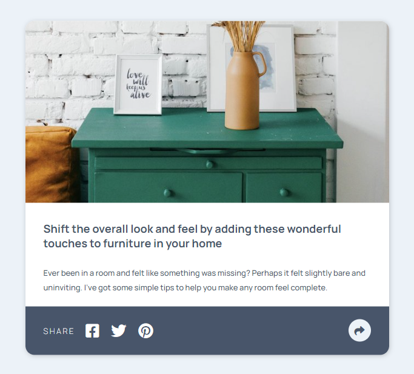
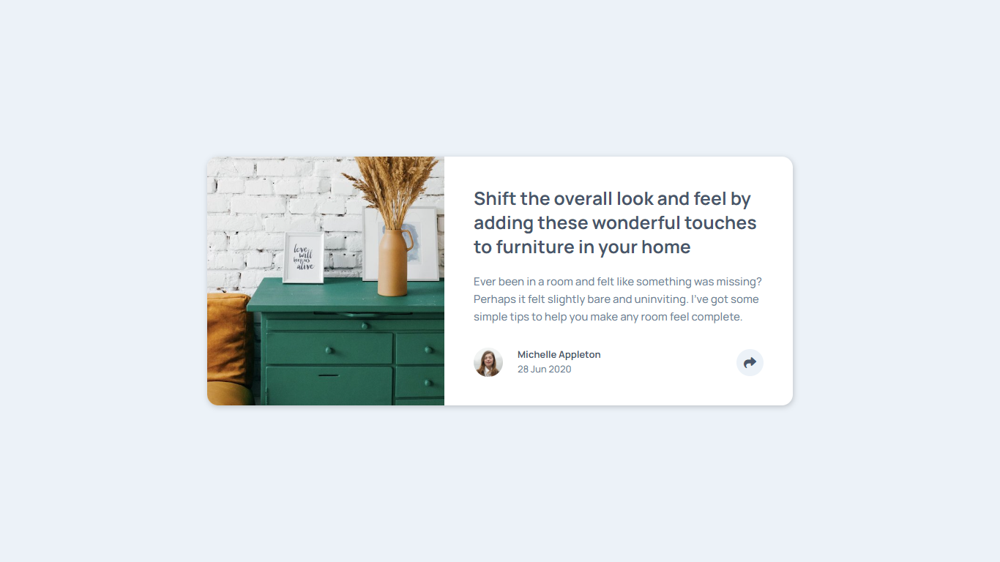
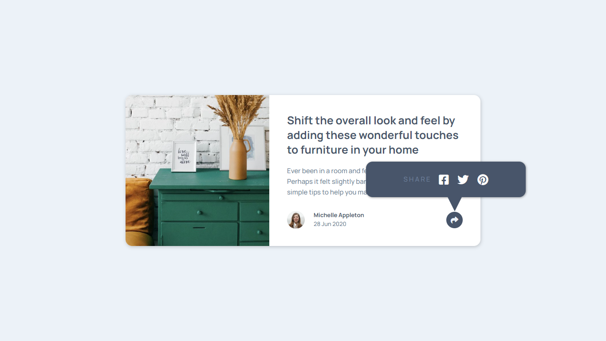

# Frontend Mentor - Article preview component solution


### The challenge

Users should be able to:

- View the optimal layout for the component depending on their device's screen size
- See the social media share links when they click the share icon

### Screenshot







### Links

- Solution URL: [Add solution URL here](https://your-solution-url.com)
- Live Site URL: [Add live site URL here](https://your-live-site-url.com)


### What I learned


```html
<h1>Nothing new</h1>
```
```css
.proud-of-this-css {
  /*nothing new */
}
```
```js
const proudOfThisFunc = () => {
  console.log('nothing new')
}
```
